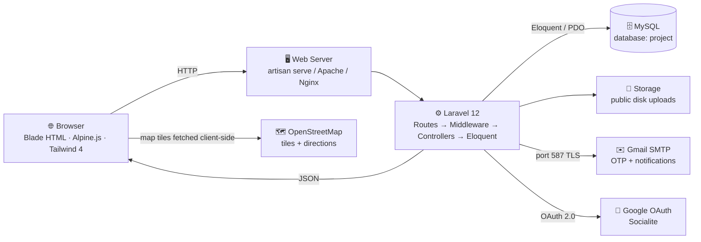
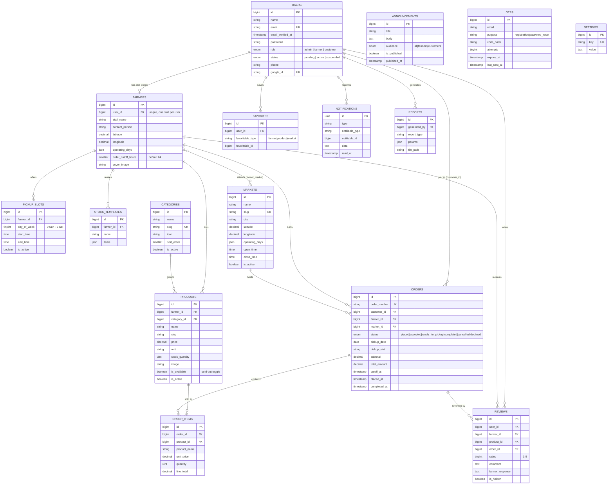

<div align="center">

# 🌿🧺 MarketLink

### Farm Fresh Just a Click Away

**eGreen Basket** · End-to-End Web Solutions · Aptech **TechWiz 7 – The World Tech Championship**

<br />


<br />

**MarketLink** is a web application that connects local farmers-market farmers with customers.
Farmers publish their weekly stock and pickup windows. Customers browse, pre-order and reserve a
pickup slot, then collect their order and pay in person at the market. The app includes maps with
directions, order tracking, reviews, notifications and a simple chat assistant. There is
**no payment gateway and no delivery**.

</div>

---

<a id="table-of-contents"></a>

## 📑 Table of Contents

| | | |
|:--|:--|:--|
| 🌱 [About the Project](#about-the-project) | 🛠️ [Tech Stack](#tech-stack) | 🏗️ [System Architecture](#system-architecture) |
| ✨ [Key Features](#key-features) | 📂 [Project Structure](#project-structure) | 🧰 [Prerequisites](#prerequisites) |
| 🚀 [Installation & Setup](#installation--setup) | 🔑 [Default Test Credentials](#default-test-credentials) | 📖 [How to Use](#how-to-use--user-guide) |
| 🗺️ [Maps & Geolocation](#maps--geolocation) | 🔐 [Authentication & Security](#authentication--security) | 🧭 [Main Routes Overview](#main-routes-overview) |
| 🧪 [Testing](#testing) | ✅ [SRS Compliance Checklist](#srs-compliance-checklist) | 📦 [Deliverables Note](#deliverables-note) |
| 🤖 [AI Tools Acknowledgement](#ai-tools-acknowledgement) | 👥 [Meet the Team](#meet-the-team) | 🙏 [Acknowledgements](#acknowledgements) |
| 📄 [License & Footer](#license--footer) | 🩺 [Troubleshooting](#troubleshooting) | 📸 [Screenshots](#screenshots) |

---

<a id="about-the-project"></a>

## 🌱 About the Project

### The problem

People who shop at farmers markets usually do not know which farmers will be there, what is in
stock this week, or what things cost. They often arrive to find popular items already sold out.

Farmers, on the other side, have no simple way to publish their weekly stock, take pre-orders
before market day, or keep in touch with regular customers.

### The solution

MarketLink gives every approved farmer an online stall and gives customers a live view of it:

- Farmers add products, quantities and prices, mark items **sold out**, and set **pickup slots**
  with an **order cutoff**.
- Customers browse markets, farmers and products, filter by category, market, market day and price,
  and place one pre-order per farmer from a single basket.
- Every order has a **pickup date and time slot** and moves through
  `placed → accepted → ready_for_pickup → completed` (or `cancelled` / `declined`).
- **Leaflet / OpenStreetMap** maps show where each market and stall is, with a **directions** link.

### Scope limits (from the SRS)

| Decision | Why |
|:--|:--|
| 💵 **No payment gateway** | Payment happens **in person at pickup**. The checkout screen says so. No card or wallet integration exists in the code. |
| 🧺 **Pickup only** | Customers collect at the market in their chosen slot. There is **no delivery or courier logic** in the app. |
| 🧑‍🌾 **Farmers must be approved** | New farmer accounts stay in `pending` and only see a waiting screen until an admin approves them. |

---

<a id="screenshots"></a>

## 📸 Screenshots

<!-- TODO: put the 6 screenshots in docs/screenshots/ as screenshot-1.png ... screenshot-6.png,
     then replace each caption below with the page name -->

<table>
  <tr>
    <td align="center" width="50%">
      <br />
      <sub><b>Screenshot 1</b></sub>
    </td>
    <td align="center" width="50%">
      <br />
      <sub><b>Screenshot 2</b></sub>
    </td>
  </tr>
  <tr>
    <td align="center">
      <br />
      <sub><b>Screenshot 3</b></sub>
    </td>
    <td align="center">
      <br />
      <sub><b>Screenshot 4</b></sub>
    </td>
  </tr>
  <tr>
    <td align="center">
      <br />
      <sub><b>Screenshot 5</b></sub>
    </td>
    <td align="center">
      <br />
      <sub><b>Screenshot 6</b></sub>
    </td>
  </tr>
</table>

---

<a id="key-features"></a>

## ✨ Key Features

<details>
<summary><b>🧺 Customer</b> - browse, pre-order, pick up, review</summary>

<br />

| Feature | Details |
|:--|:--|
| **Account creation** | Email and password registration with **6-digit OTP email verification**, or **Google sign-in** (Socialite). Google users pick a role, then verify by OTP. |
| **Browse** | Markets, farmers and product catalogues are public, no login needed. |
| **Search & filters** | Search by product name and description. Filter by **category**, **market**, **market day** and **min/max price**. Sort by newest, oldest or price. 12 items per page. |
| **Maps & directions** | Leaflet maps on the markets, farmers and checkout pages, plus a directions link that opens OpenStreetMap routing. |
| **Cart & pre-orders** | Session cart with add / update / remove / clear. Checkout groups the basket **by farmer** and creates one pre-order per farmer, each with its own **pickup date + slot**. |
| **Order tracking** | `placed → accepted → ready_for_pickup → completed`, with `cancelled` and `declined` as end states. |
| **Modify / cancel** | Allowed while the order is `placed` or `accepted` **and** before `cutoff_at` (slot start minus the farmer's `order_cutoff_hours`, default 24). |
| **Reorder** | One click reloads a previous order into the cart. |
| **Favorites** | Save **farmers**, **products** and **markets**, toggled by AJAX with a heart icon. |
| **Reviews & ratings** | 1 to 5 star reviews on completed orders, for the farmer and for products. |
| **Assistant** | Chat assistant at `/customer/assistant` (guests can use it too). Answers market hours, pickup windows, farmer info, order status and product searches. |
| **Notifications** | In-app notification centre plus email, including order status changes. |

<br />
</details>

<details>
<summary><b>🧑‍🌾 Farmer</b> - publish stock, manage orders, read the numbers</summary>

<br />

| Feature | Details |
|:--|:--|
| **Registration & approval** | Sign-up needs a stall name and contact person. The account starts as `pending` until an admin approves it. Pending farmers can only see the pending page, edit their profile and log out. |
| **Stall profile** | Stall name, contact person, phone, description, address, cover image, **draggable map pin** (latitude and longitude), operating days, markets, and `order_cutoff_hours` (0 to 168). |
| **Product CRUD** | Create, edit, delete and list products with image, category, price, unit and stock quantity. |
| **Sold-out toggle** | One-click availability switch per product (`is_available`). |
| **Weekly stock templates** | Save a named template and **apply** it to create the week's products in bulk. |
| **Pickup slots** | Weekday start/end time windows that can be created, switched on or off, and deleted. |
| **Order management** | Incoming order list and detail pages. Accept, decline, mark ready, mark completed. |
| **Insights** | Total orders, completed orders, revenue, average order value, a **30-day sales chart**, orders by status, **top products** and revenue by market (Chart.js). |
| **Dashboard extras** | Recent orders, best sellers, **low-stock alerts** (quantity 5 or less) and announcements for farmers. |
| **Reviews** | Read all reviews, see the average rating, and post a public **reply**. |

<br />
</details>

<details>
<summary><b>🛡️ Admin</b> - run the platform</summary>

<br />

| Feature | Details |
|:--|:--|
| **Dashboard** | Farmers (total and pending), customers, markets, products, orders (total and active), completed revenue, orders and revenue charts over 7 / 30 / 90 days, orders by status, top 5 farmers by revenue, latest farmers, orders and reviews. |
| **Farmer management** | List, view, **approve**, **suspend**, **restore** and delete farmers. |
| **Customer management** | List, view and **activate / deactivate** customer accounts. |
| **Market CRUD** | Create, edit and delete markets with name, slug, address, city, description, operating days, open/close times, image and **coordinates picked on a draggable map**. |
| **Content moderation** | Delete products, hide or unhide reviews. |
| **Reports** | Six **CSV** reports (Orders, Farmers Performance, Markets Summary, Customers Summary, Products Catalogue, Reviews & Ratings) with optional date range, saved for later download. |
| **Categories** | Manage categories with slug, description, icon, sort order and active flag. |
| **Announcements** | Publish to **all**, **farmers only** or **customers only**. Edit, delete, publish. |
| **Orders** | Platform-wide order list and detail pages. |
| **Settings** | Nine cached settings: `site_name`, `site_tagline`, `contact_email`, `contact_phone`, `contact_address`, `contact_latitude`, `contact_longitude`, `footer_text`, `announcement_banner`. Read anywhere with the `settings()` helper. |

<br />
</details>

<details>
<summary><b>⚙️ Platform-wide</b></summary>

<br />

- **Role-based access control:** a `role` middleware (`role:admin`, `role:farmer`, `role:customer`)
  plus a `farmer.approved` middleware, and a separate Blade layout for each role. Suspended
  accounts are logged out on their next request.
- **Dark / light mode:** toggle in the header, saved in `localStorage`, defaults to the visitor's
  system setting. Built with a Tailwind 4 `@custom-variant dark` on the `.dark` root class.
- **Responsive:** mobile-first Tailwind layout, with a smaller hero image for phones.
- **Form validation:** password of **8 to 16 characters with uppercase, lowercase, number and
  symbol** (checked live in the browser and again by `Password::defaults()` on the server), and
  phone numbers of **10 to 15 digits, numbers only**.
- **OTP:** 6-digit code, 10 minute expiry, 5 attempts, **60 second resend cooldown**, and rate
  limits of 12 verify / 6 resend requests per minute.
- **Password recovery:** forgot-password request followed by an OTP-checked reset.
- **Notifications:** sent on both the `database` and `mail` channels. `NewOrderNotification` goes to
  the farmer after the order is saved, `OrderStatusNotification` goes to the customer when the
  status changes, and `RestockNotification` goes to customers who favorited a product when it
  becomes available again.
- **Policies:** `OrderPolicy` and `ProductPolicy`.
- **Health check:** `/up` (Laravel's built-in route).

<br />
</details>

---

<a id="tech-stack"></a>

## 🛠️ Tech Stack

| Layer | Technology | Version | Purpose |
|:--|:--|:--|:--|
| Language | **PHP** | `^8.2` | Server-side runtime |
| Framework | **Laravel** | `12.69.2` | Routing, Eloquent ORM, validation, auth, mail, notifications |
| Social login | **laravel/socialite** | `5.31.0` | Google OAuth 2.0 |
| REPL | **laravel/tinker** | `2.11.1` | Debugging |
| Database | **MySQL** | 5.7+ / 8.x | Storage (database name: `project`) |
| CSS | **Tailwind CSS** | `4.3.3` | Styling through the `@tailwindcss/vite` plugin |
| JavaScript | **Alpine.js** | `3.17.4` | Client-side interaction |
| HTTP client | **axios** | `1.20.0` | AJAX calls |
| Bundler | **Vite** | `7.3.6` | Asset build |
| Laravel plugin | **laravel-vite-plugin** | `2.1.0` | Blade and Vite integration |
| Maps | **Leaflet** | `1.9.4` | Interactive maps |
| Map tiles | **OpenStreetMap** | - | Tiles and directions links |
| Charts | **Chart.js** | `4.5.1` | Admin dashboard and farmer insights |
| Templates | **Blade** | (Laravel) | 68 view files, 5 layouts |
| Dev runner | **concurrently** | `9.2.4` | Runs `composer dev` |
| Testing | **PHPUnit** | `11.5.56` | Automated tests |
| Code style | **laravel/pint** | `1.30.4` | Formatting |
| Fonts | **Plus Jakarta Sans** / **Fraunces** | - | Body text and headings |

> [!NOTE]
> `PEXELS_API_KEY` is declared in `config/services.php` but no feature uses it, so it can stay
> empty. `pdf-parse` is in `package.json` but is not imported anywhere. Admin reports are CSV.

---

<a id="system-architecture"></a>

## 🏗️ System Architecture

MarketLink follows the multi-tier flow from the SRS:

1. **Browser.** Blade pages styled with Tailwind CSS 4, with Alpine.js for interaction. Leaflet loads
   map tiles straight from OpenStreetMap, so map traffic does not go through PHP.
2. **Web server.** `php artisan serve` in development (or Apache / Nginx in production) passes the
   request to `public/index.php`.
3. **Application (Laravel 12).** `bootstrap/app.php` sends the request through the middleware
   (`auth`, `role:*`, `farmer.approved`, throttles) to a controller, which validates input and uses
   Eloquent models. Gmail SMTP sends OTP and notification emails, and Socialite handles Google
   login. Uploaded images are stored on the `public` disk and served through the `public/storage`
   link.
4. **Database (MySQL).** One database (`project`) with 24 tables, accessed through Eloquent.



### Entity relationships

`favorites` is polymorphic. `favorites.favoritable_type` is `farmer`, `product` or `market`
(registered with `Relation::morphMap`), so those links are logical rather than foreign keys.



Laravel's own tables (`sessions`, `cache`, `cache_locks`, `jobs`, `job_batches`, `failed_jobs`,
`password_reset_tokens`) also exist but are left out of the diagram.

---

<a id="project-structure"></a>

## 📂 Project Structure

```text
finalmk/
├── app/
│   ├── Http/
│   │   ├── Controllers/
│   │   │   ├── Admin/                  # Dashboard, farmers, customers, markets, categories,
│   │   │   │                           # moderation, orders, reports, announcements, settings
│   │   │   ├── Auth/                   # Register, login, OTP, password reset, Google OAuth
│   │   │   ├── AssistantController.php # Rule-based chat assistant (JSON API)
│   │   │   ├── CartController.php      # Session-backed basket
│   │   │   ├── CheckoutController.php  # Groups basket by farmer, one pre-order each
│   │   │   ├── CustomerController.php  # Dashboard, orders, modify/cancel/reorder, favorites
│   │   │   ├── Farmer*.php             # Dashboard, products, slots, templates, orders
│   │   │   ├── HomeController.php      # Home, about, contact
│   │   │   ├── Market|Farmer|ProductController.php  # Public catalogues
│   │   │   ├── NotificationController.php
│   │   │   ├── ProfileController.php   # Shared profile and password change
│   │   │   └── ReviewController.php
│   │   └── Middleware/
│   │       ├── RoleMiddleware.php          # 'role' alias: admin | farmer | customer
│   │       └── EnsureFarmerApproved.php    # 'farmer.approved' alias
│   ├── Mail/OtpCodeMail.php            # The 6-digit verification email
│   ├── Models/                         # 15 Eloquent models
│   ├── Notifications/                  # NewOrder, OrderStatus, Restock (database + mail)
│   ├── Policies/                       # OrderPolicy, ProductPolicy
│   ├── Providers/AppServiceProvider.php# Password rules, morph map, OTP rate limiters
│   └── Support/helpers.php             # settings(), settings_set(), dashboard_layout()
├── bootstrap/app.php                   # Middleware aliases and /up health route
├── config/services.php
├── database/
│   ├── migrations/
│   └── seeders/DatabaseSeeder.php      # Demo data
├── public/
│   ├── images/                         # Hero images, placeholder image
│   └── build/                          # Vite output (created by npm run build)
├── resources/
│   ├── css/app.css                     # Tailwind 4 theme (leaf / cream palette) and components
│   ├── js/app.js                       # Alpine, Chart.js, Leaflet setup, theme toggle, favorites,
│   │                                   # password checklist
│   └── views/                          # 68 Blade files
│       ├── layouts/                    # app, auth, customer, farmer, admin
│       ├── components/                 # map, directions-link, product-card, password-rules
│       ├── partials/                   # header, footer, assistant widget
│       ├── admin/ customer/ farmer/    # Role pages
│       ├── auth/                       # login, register, verify-otp, reset, google-complete
│       ├── markets/ farmers/ products/ # Public catalogues
│       └── emails/otp-code.blade.php
├── routes/web.php
├── storage/app/public/                 # Uploaded images (needs storage:link)
├── tests/Feature/MarketLinkCompleteTest.php
├── composer.json
├── package.json
├── phpunit.xml
└── vite.config.js
```

`vendor/` and `node_modules/` are left out. Install them with `composer install` and `npm install`.

---

<a id="prerequisites"></a>

## 🧰 Prerequisites

| Requirement | Version | Notes |
|:--|:--|:--|
| **PHP** | **8.2+** | Developed on 8.3. |
| **Composer** | 2.x | PHP package manager |
| **Node.js** | 18+ (20 LTS recommended) | Needed by Vite 7 |
| **npm** | comes with Node | |
| **MySQL** | 5.7+ / 8.x | XAMPP's MySQL or MariaDB works |
| **Git** | any | Only needed to clone |

**PHP extensions**

| Extension | Required? | Used for |
|:--|:--|:--|
| `pdo_mysql` | Yes | MySQL access |
| `mbstring` | Yes | String handling |
| `openssl` | Yes | Hashing and TLS to Gmail |
| `fileinfo` | Yes | Image upload type detection |
| `xml` / `dom` | Yes | Laravel and PHPUnit |
| `zip` | Yes | Composer |
| `ctype`, `json`, `tokenizer`, `bcmath` | Yes | Core Laravel |
| `curl` | Recommended | Google OAuth requests |
| `gd` | Optional | Not used by the current code |
| `pdo_sqlite` | Tests only | `phpunit.xml` uses in-memory SQLite |

Check what you have:

```bash
php -v
php -m
```

On XAMPP, enable extensions by removing the `;` in `C:\xampp\php\php.ini`, then **restart Apache**.

---

<a id="installation--setup"></a>

## 🚀 Installation & Setup

The commands are for **Windows (XAMPP + PowerShell)** and are run from the project folder. On
macOS or Linux use `cp` instead of `Copy-Item`.

### 1. Get the code

```powershell
git clone https://github.com/YOUR-ORG-OR-USER/marketlink.git finalmk
cd finalmk
```

Or extract the project zip and open a terminal in that folder.

### 2. Install PHP dependencies

```powershell
composer install
```

### 3. Install front-end dependencies

```powershell
npm install
```

### 4. Create your `.env`

```powershell
Copy-Item .env.example .env
```

> [!WARNING]
> `.env.example` is the plain Laravel one. It uses `sqlite`, `MAIL_MAILER=log` and
> `APP_URL=http://localhost`, and it has no Google keys. Change the values below.

Open `.env` and set at least:

```dotenv
APP_NAME=MarketLink
APP_ENV=local
APP_KEY=
APP_DEBUG=true
APP_URL=http://127.0.0.1:8000

# Database (MySQL, not sqlite)
DB_CONNECTION=mysql
DB_HOST=127.0.0.1
DB_PORT=3306
DB_DATABASE=project
DB_USERNAME=root
DB_PASSWORD=

# Sessions / cache / queue
SESSION_DRIVER=database
CACHE_STORE=database
QUEUE_CONNECTION=database
FILESYSTEM_DISK=local

# Mail: Gmail SMTP with an App Password
MAIL_MAILER=smtp
MAIL_HOST=smtp.gmail.com
MAIL_PORT=587
MAIL_ENCRYPTION=tls
MAIL_USERNAME=YOUR_GMAIL_ADDRESS@gmail.com
MAIL_PASSWORD="YOUR_GMAIL_APP_PASSWORD"
MAIL_FROM_ADDRESS=YOUR_GMAIL_ADDRESS@gmail.com
MAIL_FROM_NAME="MarketLink"

# Google OAuth (Socialite)
GOOGLE_CLIENT_ID=YOUR_GOOGLE_CLIENT_ID
GOOGLE_CLIENT_SECRET=YOUR_GOOGLE_CLIENT_SECRET
GOOGLE_REDIRECT_URI=http://127.0.0.1:8000/auth/google/callback

# Optional, not used by any feature
PEXELS_API_KEY=
```

<details>
<summary><b>📋 Full variable reference</b></summary>

<br />

| Variable | Value used in development | Required? |
|:--|:--|:--|
| `APP_NAME` | `MarketLink` | Recommended |
| `APP_ENV` | `local` | Yes |
| `APP_KEY` | generated in step 5 | Yes |
| `APP_DEBUG` | `true` (`false` in production) | Yes |
| `APP_URL` | `http://127.0.0.1:8000` | Yes, must match the browser host |
| `DB_CONNECTION` | `mysql` | Yes |
| `DB_HOST` / `DB_PORT` | `127.0.0.1` / `3306` | Yes |
| `DB_DATABASE` | `project` | Yes |
| `DB_USERNAME` / `DB_PASSWORD` | `root` / empty | Yes |
| `SESSION_DRIVER` / `SESSION_LIFETIME` | `database` / `120` | Yes |
| `CACHE_STORE` | `database` | Yes |
| `QUEUE_CONNECTION` | `database` | Yes |
| `MAIL_MAILER` | `smtp` | Yes, for OTP and notifications |
| `MAIL_HOST` / `MAIL_PORT` | `smtp.gmail.com` / `587` | Yes |
| `MAIL_ENCRYPTION` | `tls` (Laravel 12 does not read this, see the note in step 7) | No effect |
| `MAIL_USERNAME` / `MAIL_PASSWORD` | Gmail address / App Password | Yes |
| `MAIL_FROM_ADDRESS` / `MAIL_FROM_NAME` | Gmail address / `MarketLink` | Yes |
| `GOOGLE_CLIENT_ID` / `GOOGLE_CLIENT_SECRET` | from Google Cloud Console | Only for Google sign-in |
| `GOOGLE_REDIRECT_URI` | `http://127.0.0.1:8000/auth/google/callback` | Only for Google sign-in |
| `PEXELS_API_KEY` | empty | Not used |

<br />
</details>

### 5. Generate the app key

```powershell
php artisan key:generate
```

### 6. Create the MySQL database

Start MySQL in the XAMPP Control Panel, then create a database with the same name as `DB_DATABASE`:

```powershell
C:\xampp\mysql\bin\mysql.exe -u root -e "CREATE DATABASE IF NOT EXISTS project CHARACTER SET utf8mb4 COLLATE utf8mb4_unicode_ci;"
```

Or in phpMyAdmin (<http://127.0.0.1/phpmyadmin>): **New**, name it `project`, collation
`utf8mb4_unicode_ci`, then **Create**.

### 7. Set up Gmail SMTP

OTP codes, order emails and password resets are sent through Gmail. A normal Gmail password will
not work, you need a 16-character **App Password**.

1. Turn on **2-Step Verification** for the Gmail account.
2. Open <https://myaccount.google.com/apppasswords>.
3. Create an app password named `MarketLink`.
4. Paste the code into `MAIL_PASSWORD` inside double quotes:

```dotenv
MAIL_PASSWORD="abcd efgh ijkl mnop"
```

5. Use the same Gmail address for `MAIL_USERNAME` and `MAIL_FROM_ADDRESS`.

> [!NOTE]
> Laravel 12 reads `MAIL_SCHEME`, not `MAIL_ENCRYPTION`. Mail still works on port 587 because
> Symfony Mailer starts TLS automatically. Do not set `MAIL_SCHEME=smtps` (that is for port 465).

### 8. Set up Google login (optional)

Login with email, password and OTP works without Google.

1. Open the [Google Cloud Console](https://console.cloud.google.com/) and create or pick a project.
2. Set up the **OAuth consent screen** and add your Gmail as a test user.
3. Go to **Credentials**, then **Create Credentials**, then **OAuth client ID**, type **Web application**.
4. Add this **Authorized redirect URI**: `http://127.0.0.1:8000/auth/google/callback`
5. Copy the Client ID and Client secret into `.env`.

> [!IMPORTANT]
> **Use the same host in all four places:** `APP_URL`, `GOOGLE_REDIRECT_URI`, the Google Console
> redirect URI, and the browser address bar must all use `http://127.0.0.1:8000`.
>
> `localhost` and `127.0.0.1` are different origins for Google and for the session cookie. If you
> open the site as `localhost` while the redirect URI says `127.0.0.1`, Google login fails with
> `InvalidStateException` and you are sent back to `/login`.
>
> After editing `.env`, run `php artisan config:clear`.

Existing accounts are matched by `google_id` or email and signed in directly. New Google users go
to `/auth/google/complete` to choose Customer or Farmer, then verify by OTP. Suspended accounts are
refused.

### 9. Run migrations and seed demo data

```powershell
php artisan migrate --seed
```

This creates all tables and adds demo data: 1 admin, 4 customers, 6 approved farmers, 1 pending
farmer, 4 markets, 8 categories, 24 products, orders, reviews, favorites and announcements.

To delete everything and start again (**this removes all data**):

```powershell
php artisan migrate:fresh --seed
```

### 10. Link the storage folder

```powershell
php artisan storage:link
```

Without this, uploaded product and cover images will not show.

### 11. Build the front-end assets

```powershell
npm run build
```

Or use `npm run dev` while developing.

> [!WARNING]
> If you skip this you will get `Vite manifest not found` on every page.

### 12. Start the server

```powershell
php artisan serve --host=127.0.0.1 --port=8000
```

### 13. Open the app

👉 <http://127.0.0.1:8000> (health check: <http://127.0.0.1:8000/up>)

---

<details>
<summary><b>⚡ Shortcut commands (<code>composer setup</code> / <code>composer dev</code>)</b></summary>

<br />

`composer setup` installs packages, creates `.env`, generates the key, runs migrations and builds
assets. It does not seed data, create the database or run `storage:link`, so run
`php artisan db:seed` and `php artisan storage:link` afterwards.

`composer dev` starts the server, queue listener, log viewer and Vite together. Stop them all with
`Ctrl+C`.

<br />
</details>

<details>
<summary><b>🐧 macOS / Linux</b></summary>

<br />

```bash
cp .env.example .env
php artisan key:generate
mysql -u root -e "CREATE DATABASE IF NOT EXISTS project CHARACTER SET utf8mb4 COLLATE utf8mb4_unicode_ci;"
php artisan migrate --seed
php artisan storage:link
npm install && npm run build
php artisan serve --host=127.0.0.1 --port=8000
```

<br />
</details>

---

<a id="troubleshooting"></a>

## 🩺 Troubleshooting

These are problems we ran into while building the project.

| Problem | Cause | Fix |
|:--|:--|:--|
| `cURL error 60: SSL certificate problem` | PHP on Windows has no CA bundle | Download [`cacert.pem`](https://curl.se/ca/cacert.pem) and set `curl.cainfo` and `openssl.cafile` to its path in `C:\xampp\php\php.ini`. Restart Apache. |
| `InvalidStateException` and you land back on `/login` | `localhost` and `127.0.0.1` mixed | Use `http://127.0.0.1:8000` in `.env`, Google Console and the browser, then `php artisan config:clear`. |
| `Malformed auth code` / `invalid_grant` | The Google callback URL was refreshed or opened twice | Start again from the login page. Never reload the callback URL. |
| Images show as broken icons | Storage link is missing | `php artisan storage:link`, then hard refresh. |
| `.env` changes do nothing | Config is cached | `php artisan config:clear` (or `php artisan optimize:clear`). |
| OTP email does not arrive | `MAIL_MAILER` still `log`, wrong App Password, or mail in spam | Set `MAIL_MAILER=smtp`, use a Gmail App Password, check spam and `storage/logs/laravel.log`. |
| `Vite manifest not found` | Assets not built | `npm run build` |
| `Unknown database 'project'` | Database not created | See step 6. |
| `Specified key was too long` | Old MySQL or MyISAM tables | Use MySQL 5.7+ / 8.x with InnoDB and utf8mb4. |
| `Column 'latitude' cannot be null` | Older schema | Run `php artisan migrate`. |
| `could not find driver (Connection: sqlite)` when testing | `pdo_sqlite` disabled | Enable `extension=pdo_sqlite` in `php.ini` and restart. |
| `419 Page Expired` | CSRF token or session expired | Refresh and submit again. |
| `Port 8000 is already in use` | Another server is running | Use another port and update `APP_URL`, `GOOGLE_REDIRECT_URI` and the Google Console URI. |
| Farmer stuck on the pending page | Waiting for approval | Log in as admin, open **Farmers**, click **Approve**. |
| Old site name or footer shows | Settings are cached | `php artisan cache:clear` or save the admin Settings page. |

---

<a id="default-test-credentials"></a>

## 🔑 Default Test Credentials

Created by `php artisan migrate --seed`. All accounts use the same password.

```text
Password for all seeded accounts:  Password123
```

> [!NOTE]
> Seeded users are already email-verified, so **login skips the OTP step**. To see the OTP flow,
> register a new account.

### 🛡️ Administrator

| Role | Name | Email | Password |
|:--|:--|:--|:--|
| Admin | MarketLink Admin | `admin@marketlink.test` | `Password123` |

### 🧺 Customers

| Role | Name | Email | Password |
|:--|:--|:--|:--|
| Customer | Amara Njoroge | `amara.njoroge@example.com` | `Password123` |
| Customer | Brian Otieno | `brian.otieno@example.com` | `Password123` |
| Customer | Chloe Mwangi | `chloe.mwangi@example.com` | `Password123` |
| Customer | David Kiprop | `david.kiprop@example.com` | `Password123` |

### 🧑‍🌾 Farmers (approved)

| Role | Name | Stall | Email | Password |
|:--|:--|:--|:--|:--|
| Farmer | Wanjiku Mwangi | Green Valley Organics | `wanjiku.mwangi@example.com` | `Password123` |
| Farmer | Peter Kariuki | Kariuki Family Farm | `peter.kariuki@example.com` | `Password123` |
| Farmer | Achieng Odhiambo | Lake Basin Fresh Fish | `achieng.odhiambo@example.com` | `Password123` |
| Farmer | Samuel Ndegwa | Ndegwa Grains & Pulses | `samuel.ndegwa@example.com` | `Password123` |
| Farmer | Grace Wambui | Wambui Orchards | `grace.wambui@example.com` | `Password123` |
| Farmer | Joseph Maina | Maina Bee Keepers | `joseph.maina@example.com` | `Password123` |

### ⏳ Farmer (pending approval)

| Role | Name | Stall | User status | Email | Password |
|:--|:--|:--|:--|:--|:--|
| Farmer | Faith Njeri | Njeri Hydroponics | `pending` | `faith.njeri@example.com` | `Password123` |

Faith lands on `/farmer/pending`. Approve her from **Admin, Farmers** to unlock the farmer dashboard.

> [!WARNING]
> These are demo accounts for evaluation only. Change every password before any real use.

---

<a id="how-to-use--user-guide"></a>

## 📖 How to Use / User Guide

<details open>
<summary><b>🧺 Customer flow</b></summary>

1. **Register** at `/register`, choose **Customer**, and submit. A 6-digit code is emailed to you.
2. **Verify** the code at `/verify-otp`. Resend has a 60 second cooldown, you get 5 attempts, and
   the code expires after 10 minutes.
3. **Browse** the homepage, `/markets`, `/farmers` or `/products` and use the search and filters.
4. **Open the map** on any market or farmer page and click **Get directions**.
5. **Add to basket** from a product card or detail page, then open `/customer/cart`.
6. **Check out** at `/customer/checkout`. The basket is split by farmer. For each farmer, pick a
   **pickup date** and an **active time slot**. The cutoff is enforced here.
7. **Pay at pickup.** Nothing is charged online.
8. **Track** the order at `/customer/orders`. You can edit or cancel until the cutoff.
9. **Reorder** past orders, **favorite** farmers, products and markets, and leave a **1 to 5 star
   review** after an order is completed.
10. Ask the **assistant** at `/customer/assistant`, for example *"What markets are open today?"*
    or *"Do you have fresh eggs?"*.

</details>

<details>
<summary><b>🧑‍🌾 Farmer flow</b></summary>

1. **Register** at `/register`, choose **Farmer**, and enter your **stall name** and **contact
   person**. The account starts as `pending`.
2. **Verify your email** with the OTP, then wait on `/farmer/pending`. You can still edit your
   stall profile.
3. An **admin approves** you and you get the full dashboard on your next login.
4. **Complete your profile** at `/farmer/profile/edit`: description, phone, address, cover image,
   operating days, markets, **order cutoff** (0 to 168 hours) and **map pin**. Click the map or
   drag the marker and the latitude and longitude fields update.
5. **Add products** at `/farmer/products/create`. Save a **stock template** at
   `/farmer/stock-templates` and **Apply** it each week.
6. **Add pickup slots** at `/farmer/pickup-slots` (a weekday plus start and end time). Switch a
   slot off to stop bookings without deleting it.
7. Use the **sold-out switch** on `/farmer/products` when an item runs out.
8. **Manage orders** at `/farmer/orders`: accept, mark **Ready for Pickup**, then **Completed**.
   Decline if you cannot fulfil an order.
9. Check `/farmer/insights` for sales, best sellers and revenue by market. The dashboard also shows
   **low stock** (5 units or less).
10. **Reply to reviews** at `/farmer/reviews`. Replies are public.

</details>

<details>
<summary><b>🛡️ Admin flow</b></summary>

1. **Log in** as `admin@marketlink.test` and you land on `/admin/dashboard`.
2. **Read the metrics** and charts (7 / 30 / 90 day views).
3. **Approve farmers** at `/admin/farmers`. You can also **Suspend**, **Restore** or **Delete**.
4. **Manage customers** at `/admin/customers` and activate or deactivate accounts.
5. **Create markets** at `/admin/markets/create` with details and coordinates on the draggable map.
6. **Manage categories** at `/admin/categories`.
7. **Moderate content** at `/admin/products` and `/admin/reviews`.
8. **Review all orders** at `/admin/orders`.
9. **Generate reports** at `/admin/reports`. Pick one of six types, set an optional date range, and
   download the CSV now or later from the history list.
10. **Publish announcements** at `/admin/announcements` to all, farmers or customers.
11. **Change settings** at `/admin/settings` (site name, tagline, contact details, footer text,
    banner). Saving clears the settings cache.

</details>

---

<a id="maps--geolocation"></a>

## 🗺️ Maps & Geolocation

**Library:** [Leaflet 1.9.4](https://leafletjs.com/) with [OpenStreetMap](https://www.openstreetmap.org/)
tiles (`https://{s}.tile.openstreetmap.org/{z}/{x}/{y}.png`). No API key or account is needed. The
browser loads the tiles directly.

**Where maps appear** (10 Blade views use the shared `<x-map>` component):

| Page | Route | What the map shows |
|:--|:--|:--|
| Markets directory | `/markets` | A pin for every active market |
| Market detail | `/markets/{slug}` | The market location |
| Farmers directory | `/farmers` | A pin per approved farmer with a popup linking to the stall |
| Farmer stall page | `/farmers/{farmer}` | The stall location |
| Customer checkout | `/customer/checkout` | Each farmer's location next to the pickup slot picker |
| Farmer profile editor | `/farmer/profile/edit` | Draggable pin that fills the latitude and longitude fields |
| Admin market create | `/admin/markets/create` | Draggable pin for market coordinates |
| Admin market edit | `/admin/markets/edit` | Draggable pin with the saved coordinates |
| Admin farmer detail | `/admin/farmers/{farmer}` | The farmer's registered location |
| Contact page | `/contact` | The contact point marker |

**How it works.** `resources/views/components/map.blade.php` renders a container and calls
`window.initLeafletMap(el, options)` from `resources/js/app.js`. That function creates the map,
adds the OSM tiles and markers, escapes popup text, fits the map to all markers, and can make the
pin draggable. When a pin moves it sends a `pin-moved` event that writes the coordinates into the
form fields, and typing in the fields moves the pin.

**Directions.** `resources/views/components/directions-link.blade.php` adds a **Get directions**
button on farmer and market pages. It opens OpenStreetMap routing (OSRM) in a new tab with the
destination filled in.

**Dark mode.** Map tiles and popups are restyled under `.dark` to match the theme.

---

<a id="authentication--security"></a>

## 🔐 Authentication & Security

### Email OTP verification

| Property | Value | Defined in |
|:--|:--|:--|
| Code | 6 digits | `app/Models/Otp.php` |
| Expiry | 10 minutes | `app/Models/Otp.php` |
| Max attempts | 5, then locked | `app/Models/Otp.php` |
| Resend cooldown | 60 seconds | `app/Models/Otp.php` |
| Rate limits | `otp-verify` 12/min, `otp-resend` 6/min | `app/Providers/AppServiceProvider.php` |
| Purposes | `registration`, `password_reset` | `app/Models/Otp.php` |
| Storage | Only a bcrypt hash of the code is saved (`code_hash`) | `otps` table |
| Cleanup | Codes expired for more than a day are deleted when a new one is issued | `Otp::issue()` |

OTP is used for new registration, first-time Google sign-up and password reset. If someone logs in
with an unverified account, they are logged out and sent a new code. Seeded accounts are already
verified.

### Google OAuth 2.0

Uses **laravel/socialite**. `/auth/google` goes to the Google consent screen and
`/auth/google/callback` exchanges the code. Existing users are matched by `google_id` or email.
New users go to `/auth/google/complete` to pick Customer or Farmer. Errors in the callback are
written to the log as `Google OAuth callback failed` and the user sees a short message on the
login page. Suspended accounts are refused.

### Password policy

Checked on the server by `Password::defaults()` and live in the browser on the register,
Google-complete, reset and profile forms:

- 8 to 16 characters
- At least one uppercase and one lowercase letter
- At least one number
- At least one symbol

Passwords are hashed with bcrypt (`BCRYPT_ROUNDS=12`).

### Other validation

- **Phone:** `regex:/^[0-9]{10,15}$/`, 10 to 15 digits, numbers only.
- **Coordinates:** latitude between -90 and 90, longitude between -180 and 180.
- **Uploads:** must be images, maximum 4 MB, stored on the `public` disk.
- **Assistant messages:** required, up to 500 characters, limited to 40 requests per minute.

### Access control

| Mechanism | Behaviour |
|:--|:--|
| `role` middleware | Guests go to `/login`. A signed-in user with the wrong role gets **403**. |
| Suspended accounts | Logged out and the session is reset, in both `RoleMiddleware` and the login controller. |
| `farmer.approved` middleware | A `pending` farmer can only open the pending page, edit the profile and log out. |
| Ownership checks | Controllers check that an order belongs to the signed-in customer or farmer before showing or changing it. |
| Policies | `OrderPolicy` and `ProductPolicy`. |
| Product visibility | A product page returns 404 unless the product is active and its farmer is active. |

### Web security

- **CSRF** protection on all forms. AJAX requests send the `X-CSRF-TOKEN` header.
- **SQL injection:** only Eloquent and the query builder are used, so values are bound.
- **XSS:** Blade escapes output, and map popup text is escaped too.
- **Sessions:** regenerated on login, invalidated on logout and on suspension.
- **Secrets** stay in `.env`, which is git-ignored.

---

<a id="main-routes-overview"></a>

## 🧭 Main Routes Overview

<details>
<summary><b>🌐 Public</b></summary>

<br />

| Method | URI | Name | Purpose |
|:--|:--|:--|:--|
| GET | `/` | `home` | Landing page |
| GET | `/about` | `about` | About the project |
| GET | `/contact` | `contact` | Contact details and map |
| GET | `/markets` | `markets.index` | Market directory with map |
| GET | `/markets/{market:slug}` | `markets.show` | Single market |
| GET | `/farmers` | `farmers.index` | Farmer directory with map |
| GET | `/farmers/{farmer}` | `farmers.show` | Stall page, products, reviews |
| GET | `/products` | `products.index` | Catalogue with search and filters |
| GET | `/products/{product}` | `products.show` | Product detail |
| POST | `/assistant/chat` | `assistant.chat` | Assistant API (40/min) |
| GET | `/up` | - | Health check |

<br />
</details>

<details>
<summary><b>🔑 Guest / authentication</b></summary>

<br />

| Method | URI | Name | Purpose |
|:--|:--|:--|:--|
| GET / POST | `/register` | `register` | Sign up |
| GET / POST | `/login` | `login` | Log in |
| GET | `/forgot-password` | `password.request` | Request a reset |
| POST | `/forgot-password` | `password.email` | Send the reset code |
| GET | `/reset-password/{token}` | `password.reset` | Reset form |
| POST | `/reset-password` | `password.store` | Save the new password |
| GET | `/verify-otp` | `otp.show` | OTP screen |
| POST | `/verify-otp` | `otp.verify` | Verify (`throttle:otp-verify`) |
| POST | `/verify-otp/resend` | `otp.resend` | Resend (`throttle:otp-resend`) |
| GET | `/auth/google` | `google.redirect` | Start Google login |
| GET | `/auth/google/callback` | `google.callback` | Google callback |
| GET / POST | `/auth/google/complete` | `google.complete` / `.store` | Choose role after Google sign-up |

<br />
</details>

<details>
<summary><b>👤 Any logged-in user</b></summary>

<br />

| Method | URI | Name | Purpose |
|:--|:--|:--|:--|
| POST | `/logout` | `logout` | Log out |
| GET / PUT | `/profile` | `profile.edit` / `profile.update` | Profile |
| PUT | `/profile/password` | `profile.password` | Change password |
| GET | `/notifications` | `notifications.index` | Notifications |
| POST | `/notifications/{id}/read` | `notifications.read` | Mark one as read |
| POST | `/notifications/read-all` | `notifications.readAll` | Mark all as read |
| POST | `/favorites/toggle` | `favorites.toggle` | Save or remove a favorite |

<br />
</details>

<details>
<summary><b>🧺 Customer</b> - prefix <code>/customer</code>, <code>role:customer</code></summary>

<br />

| Method | URI | Name |
|:--|:--|:--|
| GET | `/customer/dashboard` | `customer.dashboard` |
| GET | `/customer/assistant` | `customer.assistant` |
| GET | `/customer/cart` | `customer.cart.index` |
| POST | `/customer/cart/add` | `customer.cart.add` |
| PATCH | `/customer/cart/update` | `customer.cart.update` |
| DELETE | `/customer/cart/remove` | `customer.cart.remove` |
| POST | `/customer/cart/clear` | `customer.cart.clear` |
| GET / POST | `/customer/checkout` | `customer.checkout` / `.store` |
| GET | `/customer/orders` | `customer.orders.index` |
| GET | `/customer/orders/{order}` | `customer.orders.show` |
| GET / PUT | `/customer/orders/{order}/edit` and `/customer/orders/{order}` | `customer.orders.edit` / `.update` |
| POST | `/customer/orders/{order}/cancel` | `customer.orders.cancel` |
| POST | `/customer/orders/{order}/reorder` | `customer.orders.reorder` |
| GET | `/customer/favorites` | `customer.favorites` |
| POST | `/customer/reviews` | `customer.reviews.store` |

<br />
</details>

<details>
<summary><b>🧑‍🌾 Farmer</b> - prefix <code>/farmer</code>, <code>role:farmer</code> (+ <code>farmer.approved</code>)</summary>

<br />

| Method | URI | Name |
|:--|:--|:--|
| GET | `/farmer/pending-approval` | `farmer.pending` (also open while pending) |
| GET | `/farmer/dashboard` | `farmer.dashboard` |
| GET / PUT | `/farmer/profile/edit` and `/farmer/profile` | `farmer.profile.edit` / `.update` |
| GET | `/farmer/products` and `/farmer/products/create` | `farmer.products.index` / `.create` |
| POST / PUT / DELETE | `/farmer/products` and `/farmer/products/{product}` | `farmer.products.store` / `.update` / `.destroy` |
| GET | `/farmer/products/{product}/edit` | `farmer.products.edit` |
| POST | `/farmer/products/{product}/toggle-availability` | `farmer.products.toggle` |
| GET / POST | `/farmer/stock-templates` | `farmer.templates.index` / `.store` |
| DELETE / POST | `/farmer/stock-templates/{stockTemplate}` and `.../apply` | `farmer.templates.destroy` / `.apply` |
| GET / POST | `/farmer/pickup-slots` | `farmer.slots.index` / `.store` |
| DELETE / POST | `/farmer/pickup-slots/{pickupSlot}` and `.../toggle` | `farmer.slots.destroy` / `.toggle` |
| GET | `/farmer/orders` and `/farmer/orders/{order}` | `farmer.orders.index` / `.show` |
| POST | `/farmer/orders/{order}/status` | `farmer.orders.status` |
| GET | `/farmer/insights` | `farmer.insights` |
| GET | `/farmer/reviews` | `farmer.reviews.index` |
| POST | `/farmer/reviews/{review}/respond` | `farmer.reviews.respond` |

<br />
</details>

<details>
<summary><b>🛡️ Admin</b> - prefix <code>/admin</code>, <code>role:admin</code></summary>

<br />

| Method | URI | Name |
|:--|:--|:--|
| GET | `/admin/dashboard` | `admin.dashboard` |
| GET | `/admin/farmers` and `/admin/farmers/{farmer}` | `admin.farmers.index` / `.show` |
| POST | `/admin/farmers/{farmer}/approve`, `/suspend`, `/restore` | `admin.farmers.approve` / `.suspend` / `.restore` |
| DELETE | `/admin/farmers/{farmer}` | `admin.farmers.destroy` |
| GET | `/admin/customers` and `/admin/customers/{customer}` | `admin.customers.index` / `.show` |
| POST | `/admin/customers/{customer}/toggle-status` | `admin.customers.toggle` |
| Resource | `/admin/markets` (no `show`) | `admin.markets.*` |
| GET / DELETE | `/admin/products` and `/admin/products/{product}` | `admin.products.index` / `.destroy` |
| GET / POST | `/admin/reviews` and `/admin/reviews/{review}/toggle` | `admin.reviews.index` / `.toggle` |
| Resource | `/admin/categories` (no `show`) | `admin.categories.*` |
| GET | `/admin/orders` and `/admin/orders/{order}` | `admin.orders.index` / `.show` |
| GET / POST | `/admin/reports` and `/admin/reports/generate` | `admin.reports.index` / `.generate` |
| GET | `/admin/reports/{report}/download` | `admin.reports.download` |
| GET / POST | `/admin/announcements` | `admin.announcements.index` / `.store` |
| PUT / DELETE | `/admin/announcements/{announcement}` | `admin.announcements.update` / `.destroy` |
| GET / PUT | `/admin/settings` | `admin.settings.index` / `.update` |

<br />
</details>

---

<a id="testing"></a>

## 🧪 Testing

The feature tests are in `tests/Feature/MarketLinkCompleteTest.php`, next to Laravel's default
example tests.

```powershell
php artisan test
```

or

```powershell
composer test
```

`phpunit.xml` runs the tests on an in-memory SQLite database, so the `pdo_sqlite` PHP extension
must be enabled in `php.ini`.

---

<a id="srs-compliance-checklist"></a>

## ✅ SRS Compliance Checklist

<details open>
<summary><b>🧺 Customer requirements</b></summary>

<br />

| # | SRS requirement | Status | Where |
|:--|:--|:--:|:--|
| 1 | Registration with email OTP verification | ✅ | `RegisteredUserController`, `OtpVerificationController`, `OtpCodeMail` |
| 2 | Google sign-in | ✅ | `Auth/GoogleController` with Socialite |
| 3 | Browse markets, farmers, products | ✅ | `MarketController`, `FarmerController`, `ProductController` |
| 4 | Search and filters | ✅ | `ProductController::index` |
| 5 | Map with directions | ✅ | `<x-map>` and `<x-directions-link>` |
| 6 | Cart and pre-orders with pickup slots | ✅ | `CartController`, `CheckoutController` |
| 7 | Order tracking | ✅ | `orders.status` enum |
| 8 | Modify or cancel before cutoff | ✅ | `Order::canBeModified()` / `canBeCancelled()` |
| 9 | Reorder | ✅ | `CustomerController::orderReorder` |
| 10 | Favorites | ✅ | `FavoriteController`, polymorphic `favorites` table |
| 11 | Reviews and ratings | ✅ | `ReviewController` |
| 12 | AI assistant (optional) | ✅ | `AssistantController`, rule-based (no external AI model) |
| 13 | Notifications | ✅ | `database` and `mail` channels |
| 14 | No payment gateway, pay at pickup | ✅ | No payment code, checkout says "Pay at pickup" |

<br />
</details>

<details>
<summary><b>🧑‍🌾 Farmer requirements</b></summary>

<br />

| # | SRS requirement | Status | Where |
|:--|:--|:--:|:--|
| 1 | Registration with admin approval | ✅ | `EnsureFarmerApproved`, `farmer/pending.blade.php` |
| 2 | Profile with map pin | ✅ | `FarmerDashboardController::profileUpdate` |
| 3 | Product CRUD with images | ✅ | `FarmerProductController` |
| 4 | Weekly stock templates | ✅ | `FarmerStockTemplateController` |
| 5 | Sold-out toggle | ✅ | `products.is_available` |
| 6 | Pickup slots and order cutoff | ✅ | `FarmerPickupSlotController`, `farmers.order_cutoff_hours` |
| 7 | Order management | ✅ | `FarmerOrderController` |
| 8 | Insights (orders, revenue, best sellers) | ✅ | `FarmerDashboardController` |
| 9 | Respond to reviews | ✅ | `reviews.farmer_response` |

<br />
</details>

<details>
<summary><b>🛡️ Admin requirements</b></summary>

<br />

| # | SRS requirement | Status | Where |
|:--|:--|:--:|:--|
| 1 | Dashboard metrics | ✅ | `Admin/DashboardController` |
| 2 | Approve or suspend farmers | ✅ | `Admin/FarmerManagementController` |
| 3 | Activate or deactivate customers | ✅ | `Admin/CustomerManagementController` |
| 4 | Market CRUD with coordinates | ✅ | `Admin/MarketManagementController` |
| 5 | Content moderation | ✅ | `Admin/ModerationController` |
| 6 | Reports and analytics | ✅ | `Admin/ReportController` |
| 7 | Categories | ✅ | `Admin/CategoryController` |
| 8 | Announcements | ✅ | `Admin/AnnouncementController` |
| 9 | Settings | ✅ | `Admin/SettingsController` |

<br />
</details>

<details>
<summary><b>⚙️ Other requirements</b></summary>

<br />

| # | SRS requirement | Status | Where |
|:--|:--|:--:|:--|
| 1 | Role-based access control | ✅ | `role` and `farmer.approved` middleware, policies |
| 2 | Dark and light mode | ✅ | `app.js`, `@custom-variant dark` |
| 3 | Responsive design | ✅ | Tailwind mobile-first layouts |
| 4 | Password validation (8 to 16, mixed) | ✅ | `Password::defaults()` and live checklist |
| 5 | Phone validation (10 to 15 digits) | ✅ | `regex:/^[0-9]{10,15}$/` |
| 6 | OTP with 60 second resend cooldown | ✅ | `Otp` model, route throttles |
| 7 | Forgot and reset password | ✅ | `PasswordResetLinkController`, `NewPasswordController` |
| 8 | Email and in-app notifications | ✅ | Three notification classes |
| 9 | Pickup only, no delivery | ✅ | No delivery code in the app |
| 10 | About Us and Contact Us with map | ✅ | `HomeController`, `/about`, `/contact` |

<br />
</details>

---

<a id="deliverables-note"></a>

## 📦 Deliverables Note

| Deliverable | Where |
|:--|:--|
| Working application | This repository |
| Default test credentials | [Default Test Credentials](#default-test-credentials) |
| Project report | Submitted separately as a document |
| SQL scripts | Run `php artisan migrate` for the schema, or export the `project` database from phpMyAdmin (**Export, SQL**) |
| Demo video | Submitted separately |

---

<a id="ai-tools-acknowledgement"></a>

## 🤖 AI Tools Acknowledgement

As the TechWiz SRS asks, we are stating that AI coding tools, **Qoder** and **Claude** (Anthropic),
were used on this project as assistants for coding help, debugging and code review. The team
reviewed and tested the changes and can explain how the project works.

<!-- TODO: add any other AI tools the team used, or delete this comment -->

---

<a id="meet-the-team"></a>

## 👥 Meet the Team

| # | Name | Role | Email | GitHub |
|:--:|:--|:--|:--|:--|
| 1 | Alishba Iftikhar | Member | [alishbaiftikhar2504b@aptechgdn.net](mailto:alishbaiftikhar2504b@aptechgdn.net) | [aalishbaifftikhar](https://github.com/aalishbaifftikhar) |
| 2 | Alishba | Member | [alishba2504b@aptechgdn.net](mailto:alishba2504b@aptechgdn.net) | [Rozina-Jawed] (https://github.com/Rozina-Jawed) |
| 3 | Manal | Member | [manal2504b@aptechgdn.net](mailto:manal2504b@aptechgdn.net) | [Manal-Anis](https://github.com/Manal-Anis) |
| 4 | Ahsun | Member | [ahsun2504b@aptechgdn.net](mailto:ahsun2504b@aptechgdn.net) | Ahsun Rehan (https://github.com/ehsunrehan) |
| 5 | Faiza | Member | [faiza2505d@aptechgdn.net](mailto:faiza2505d@aptechgdn.net) | faizaqazi2110-pixel(https://github.com/faizaqazi2110-pixel) |

<!-- TODO: https://github.com/Rozina-Jawed still needs to be matched to a member -->

**Project repository:** `https://github.com/YOUR-ORG-OR-USER/marketlink`

---

<a id="acknowledgements"></a>

## 🙏 Acknowledgements

Built for **Aptech TechWiz 7 – The World Tech Championship**, category **End-to-End Web
Solutions**, theme **eGreen Basket**.

| | |
|:--|:--|
| 🎓 **[Aptech](https://www.aptech-education.com/)** and the **TechWiz 7** team | For the brief and the platform to build on. |
| 🧰 **[Laravel](https://laravel.com/)** | Backend framework. |
| 🎨 **[Tailwind CSS](https://tailwindcss.com/)** | Styling. |
| 🏔️ **[Alpine.js](https://alpinejs.dev/)** | Client-side interaction. |
| ⚡ **[Vite](https://vite.dev/)** | Asset build. |
| 🗺️ **[Leaflet](https://leafletjs.com/)** | Maps. |
| 🌍 **[OpenStreetMap](https://www.openstreetmap.org/)** | Map tiles and directions. © OpenStreetMap contributors. |
| 📊 **[Chart.js](https://www.chartjs.org/)** | Charts. |
| 🔐 **[Google Identity](https://developers.google.com/identity)** and **[Socialite](https://github.com/laravel/socialite)** | Google sign-in. |
| 🔤 **[Plus Jakarta Sans](https://fonts.google.com/specimen/Plus+Jakarta+Sans)** and **[Fraunces](https://fonts.google.com/specimen/Fraunces)** | Fonts. |

---

<a id="license--footer"></a>

## 📄 License & Footer

This is an educational project made for **Aptech TechWiz 7 – The World Tech Championship**. It is
shared for evaluation and learning. Laravel is MIT-licensed. The seeded demo data (market names,
stall names, coordinates and phone numbers) is made up.

<!-- TODO: add a LICENSE file if the team wants to release the code under a specific license -->

<br />

<div align="center">

**Made with 🌱 by Team MarketLink**

*Aptech TechWiz 7 – The World Tech Championship · eGreen Basket · End-to-End Web Solutions*

`Farm Fresh Just a Click Away`

[⬆ Back to top](#table-of-contents)

</div>
